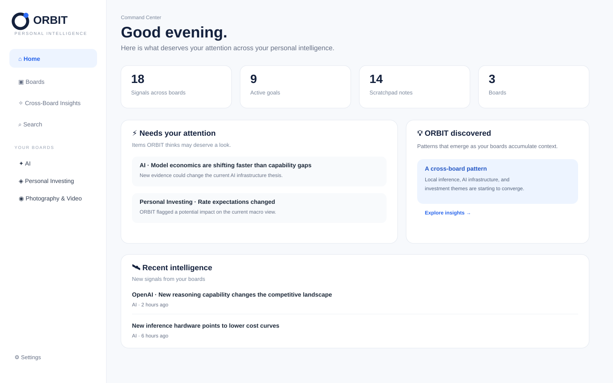
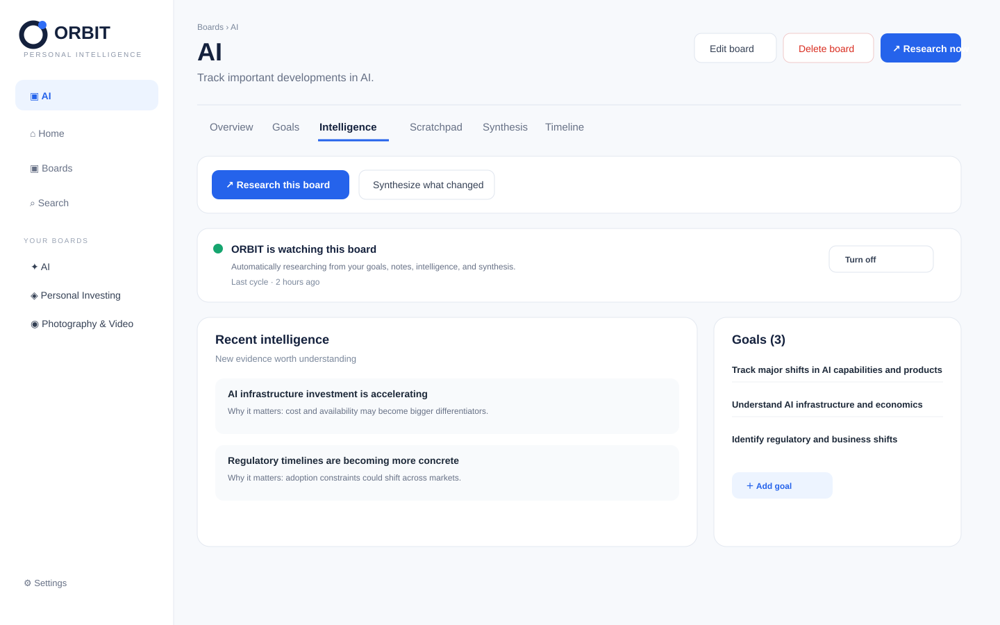
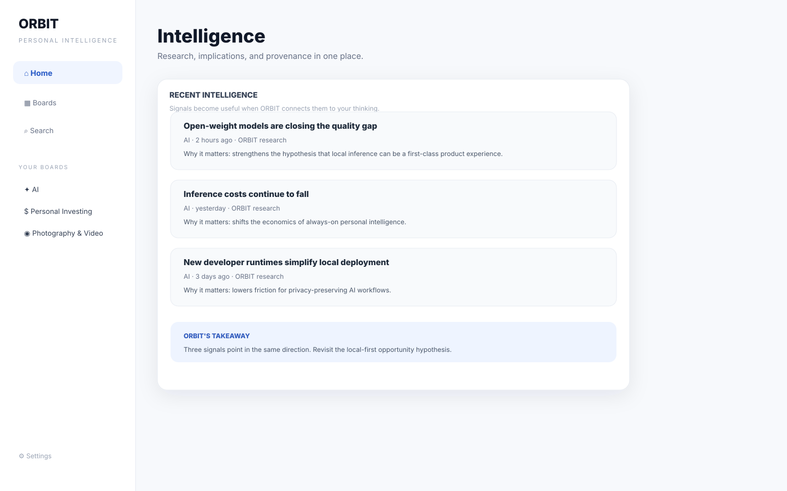
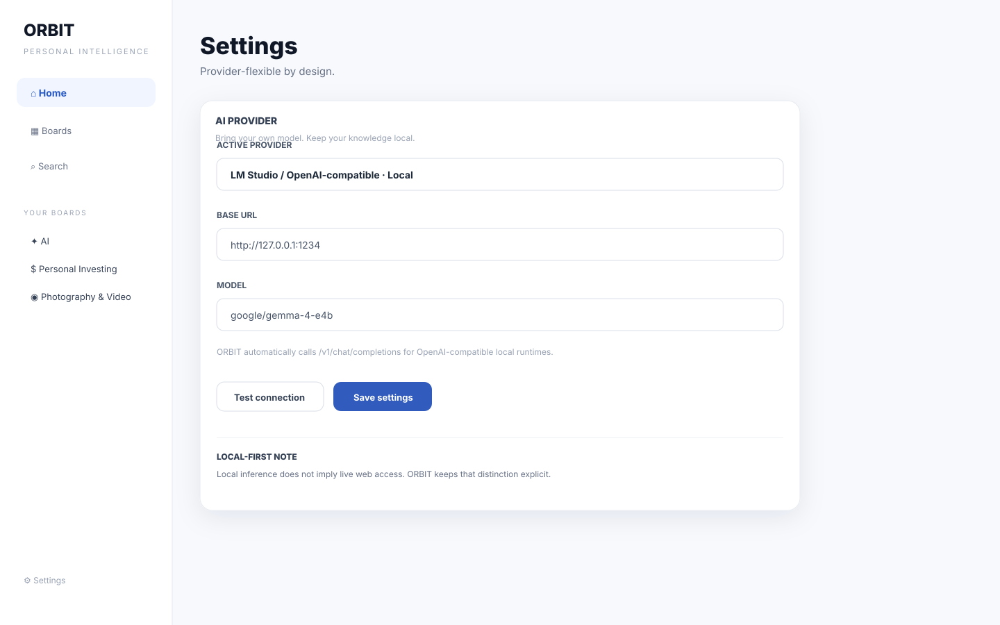

# ORBIT — Personal Intelligence Workspace

> **Capture what you think. Research what matters. Build knowledge over time.**

ORBIT is an open-source, local-first desktop workspace for people who want more than a chat history or a stream of bookmarks. Create persistent boards, add optional goals, capture thoughts, collect intelligence, and let AI help you develop your thinking over time.

## Why ORBIT?

Most AI tools optimize for **the next answer**. ORBIT is designed around **the next insight**.

The core loop is:

**Set Goal → Explore → Think → Research → Synthesize → Update Goal → Repeat**

A board can start with no goal at all. When you add a goal later, the accumulated notes and intelligence remain available for reinterpretation. The long-term vision is for ORBIT to detect **strategy drift**—when new evidence changes what you should believe, investigate, or do next.

## Product tour

### Home — what deserves your attention?



A cross-board command center for important changes, recent intelligence, recent thinking, and emerging patterns.

### Boards — where your thinking accumulates



Each board is a durable workspace with optional goals, scratchpad notes, intelligence, synthesis, and a timeline.

### Intelligence — turn signals into understanding



Research should explain **why something matters**, not just dump headlines. Every intelligence item keeps its provenance and can feed the living synthesis.

### Settings — bring your own model



Use local models through LM Studio or Ollama, or connect cloud APIs from OpenAI and Anthropic.

## Current capabilities

- **Automatic intelligence:** boards with goals can be watched continuously; ORBIT independently decides what is worth investigating and updates intelligence + synthesis without requiring a research question. Automatic research can be disabled globally or per board, with 1h / 3h / 6h / 12h / daily cadence controls.

- 🧠 Persistent boards
- 🎯 0..N goals per board
- ✍️ Scratchpad thinking
- 🔎 Intelligence and synthesis views
- 🏠 Home command center
- 🗑️ Create, edit, and delete boards
- 🦙 Ollama local models
- ⚡ LM Studio / OpenAI-compatible local models
- ☁️ OpenAI and Anthropic API providers
- 🔐 Local API-key storage using Electron `safeStorage` when available
- 🧱 SQLite local source of truth
- 🖥️ Electron desktop app

## Run on macOS

Requirements: **Node.js 22+** and npm.

1. Start the LM Studio Local Server, or have Ollama running.
2. Clone this repository.
3. Run:

```bash
npm install
npm start
```

You can also double-click `run-orbit.command` on macOS.

### LM Studio setup

In ORBIT → **Settings**:

- Provider: **LM Studio / OpenAI-compatible · Local**
- Base URL: use the server URL shown by LM Studio, for example `http://127.0.0.1:1234`
- Model: use the model identifier shown by LM Studio
- Click **Test connection**
- Click **Save settings**

ORBIT calls the OpenAI-compatible endpoint at `/v1/chat/completions`.

### Important: local models and web research

A local model does **not** automatically have live web access. ORBIT explicitly avoids pretending that local inference is web research. With the current implementation, OpenAI is the provider wired for live web-search research; local providers perform model-based analysis of the board context. More research adapters are planned.

## Architecture

```text
┌──────────────────────────────────────────────┐
│                  ORBIT UI                    │
│ Home · Boards · Goals · Intelligence · Notes │
└──────────────────────┬───────────────────────┘
                       │ IPC
┌──────────────────────▼───────────────────────┐
│              Electron main process           │
│ persistence · provider routing · secure keys │
└───────────────┬───────────────────┬──────────┘
                │                   │
        ┌───────▼───────┐   ┌──────▼──────────┐
        │    SQLite     │   │  AI providers   │
        │ local source  │   │ LM Studio        │
        │ of truth      │   │ Ollama           │
        └───────────────┘   │ OpenAI · Anthropic│
                            └──────────────────┘
```

**Design principle:** ORBIT owns the knowledge. The model provides reasoning.

See [`docs/architecture.md`](docs/architecture.md), [`docs/providers.md`](docs/providers.md), and [`docs/roadmap.md`](docs/roadmap.md).

## Default boards

A fresh ORBIT database starts with three generic boards:

- **AI**
- **Personal Investing**
- **Photography & Video**

These are examples—not hardcoded product verticals. Users can create and remove boards freely.

## Roadmap

Near-term priorities include global search, richer source provenance, model discovery, background research jobs, goal history, cross-board patterns, hypothesis tracking, and strategy-drift detection.

## Contributing

ORBIT is intentionally small and opinionated. See [`CONTRIBUTING.md`](CONTRIBUTING.md) for development principles.

## License

MIT — see [`LICENSE`](LICENSE).
